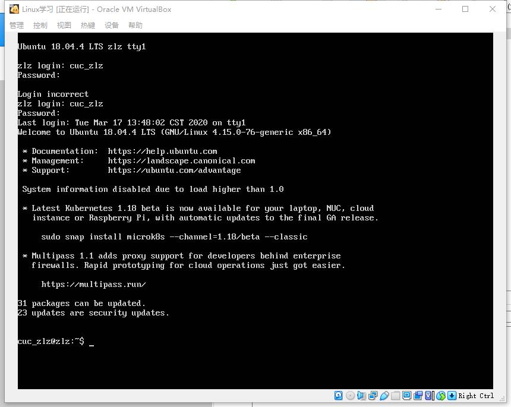
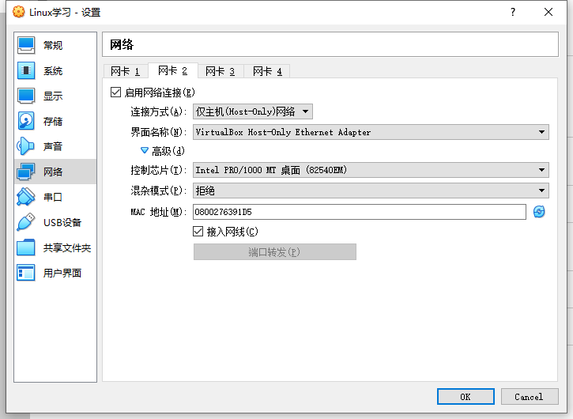
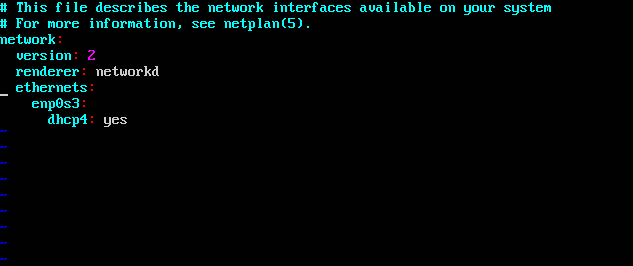
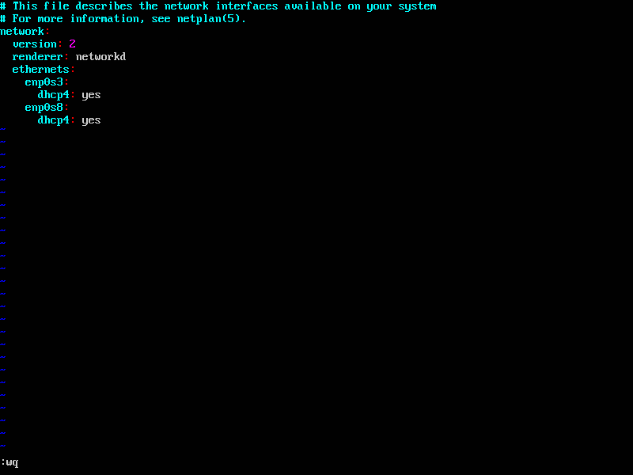
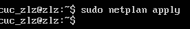
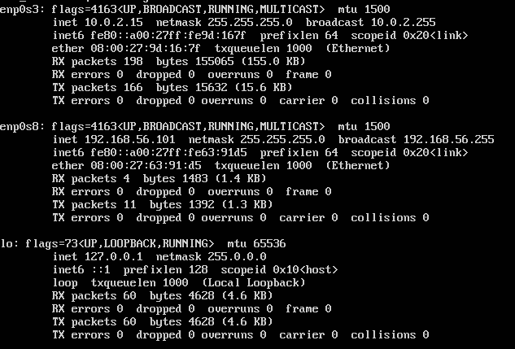

# 第一章实验

---

## 1.无人值守安装Ubuntu18.04镜像

* ### 有人值守成功安装Ubuntu18.04虚拟机

---

## 2.给虚拟机添加网卡并实现系统自动开机使用和自动获取IP

* ### 给虚拟机添加新网卡

* ### 对系统网络设置进行更改

网卡设置前

打开网络配置文件

文件更改前

文件更改后

应用设置

添加完成

---

## 3.使用sftp在虚拟机和宿主机之间传输文件