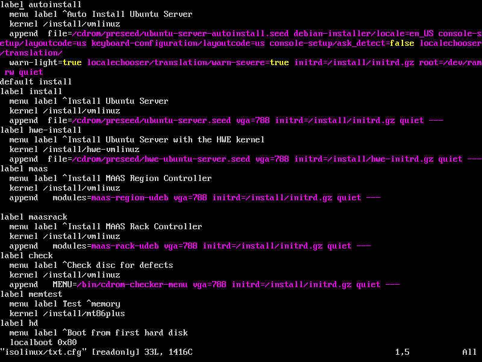

# 第一章实验

---

## 1.无人值守安装Ubuntu18.04镜像

* ### 有人值守成功安装Ubuntu18.04虚拟机

* ### 挂载镜像

* ### 同步光盘内容到工作目录

* ### 编辑安装引导界面

打开配置文件

修改配置文件

* ### 重新生成md5sum.txt

* ### 封装镜像
  * 系统中无genisoimage，安装程序

* ### 将镜像拉至宿主机

* ### 实验无人值守安装镜像的有效性
  * ### 实验几次均内核报错，但重新封装之前的镜像却能正常启动

---

## 2.给虚拟机添加网卡并实现系统自动开机使用和自动获取IP

* ### 给虚拟机添加新网卡

* ### 对系统网络设置进行更改
网卡设置前

打开网络配置文件
  

文件更改前

文件更改后

应用设置

添加完成

---

## 3.使用sftp在虚拟机和宿主机之间传输文件

* ### 连接至虚拟机并向虚拟机传输文件

* [连接方法参考csdn博客](https://blog.csdn.net/gzxdale/article/details/81140889)