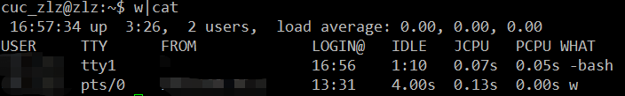
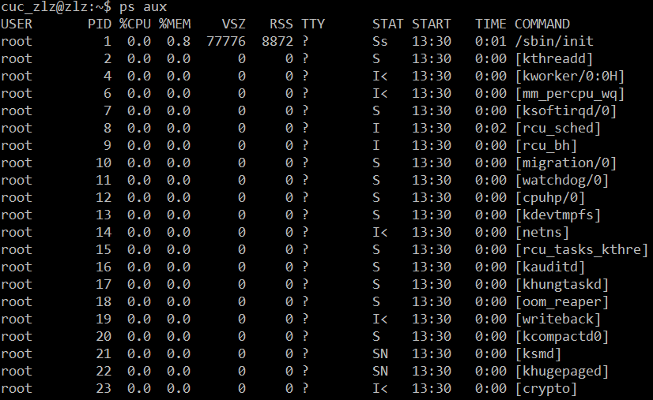
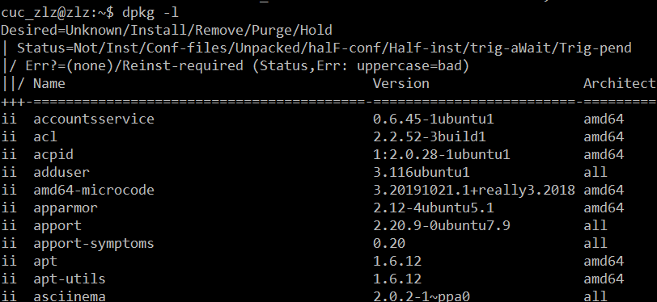
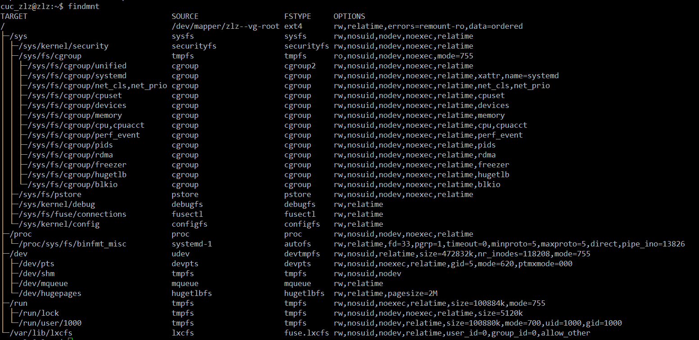
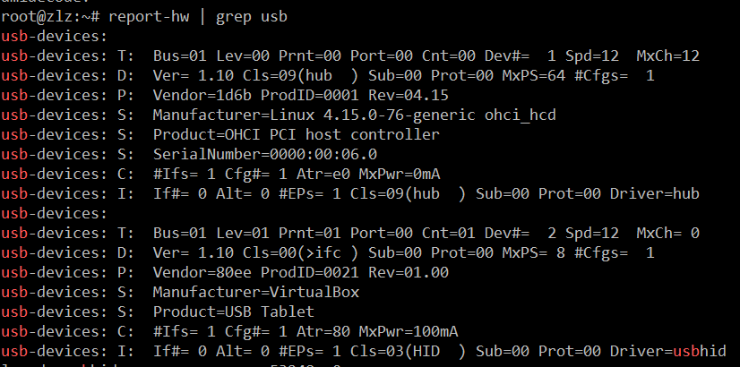

# 第二章实验

---

## 1. 注册并安装asciinema

* ### 注册asciinema

* ### 安装并配置asciinema auth
   1. #### 安装asciinema

安装仓库

更新源

安装asciinema

   2. #### 配置asciinema

配置asciinema

---

## 2. vimtutor

[vimtutor全程录屏](https://asciinema.org/a/317080)

### 完成后的自查

* vim有哪几种工作模式？

  * 四种
  * 一般模式，编辑模式，命令模式，virtual模式

* Normal模式下，从当前行开始，一次向下移动光标10行的操作方法？如何快速移动到文件开始行和结束行？如何快速跳转到文件中的第N行？

  * 从当前行开始，一次向下移动光标10行：10j
  * 快速移动到文件开始行：gg
  * 结束行：G
  * 快速跳转到文件中的第N行：NG

* Normal模式下，如何删除单个字符、单个单词、从当前光标位置一直删除到行尾、单行、当前行开始向下数N行？

  * 删除单个字符：x
  * 单个单词：dw/de
  * 从当前光标位置一直删除到行尾：d$
  * 删除单行：dd
  * 删除当前行开始向下数N行：d10j

* 如何在vim中快速插入N个空行？如何在vim中快速输入80个-？

  * 在vim中快速插入N个空行：No Esc
  * 快速输入80个-：80i- Esc

* 如何撤销最近一次编辑操作？如何重做最近一次被撤销的操作？

  * 撤销最近一次操作：u
  * 重做最近一次被撤销的操作：CTRL—R

* vim中如何实现剪切粘贴单个字符？单个单词？单行？如何实现相似的复制粘贴操作呢？
  
  * 剪切粘贴单个字符：剪切：x 粘贴：p
  * 单个单词：剪切：de/dw 粘贴：p
  * 单行：剪切：dd 粘贴：p
  * 复制粘贴：v进入virtual模式，移动光标选择要复制的内容，y复制，p粘贴

---

* 为了编辑一段文本你能想到哪几种操作方式（按键序列）？

  * i/I
  * o/O
  * ce
  * c [number] motion
  * s/S
  * a/A
  * R

* 查看当前正在编辑的文件名的方法？查看当前光标所在行的行号的方法？
  
  * CTRL+G

* 在文件中进行关键词搜索你会哪些方法？如何设置忽略大小写的情况下进行匹配搜索？如何将匹配的搜索结果进行高亮显示？如何对匹配到的关键词进行批量替换？

  * 关键词搜索：/ or ?
  * 设置忽略大小写：:set noic
  * 将匹配的搜索结果进行高亮：:set hls is
  * 对匹配到的关键词进行批量替换：:#,#s/old/new/g  or  :s/old/new/g  or  :%s/old/new/g

* 在文件中最近编辑过的位置来回快速跳转的方法？

   * 上一个位置跳转：CTRL-O
   * 下一个位置：CTRL-I

* 如何把光标定位到各种括号的匹配项？例如：找到(, [, or {对应匹配的),], or }
  
  * 快捷键 %

* 在不退出vim的情况下执行一个外部程序的方法？

  * :!commond

* 如何使用vim的内置帮助系统来查询一个内置默认快捷键的使用方法？如何在两个不同的分屏窗口中移动光标？

  * 使用vim的内置帮助系统来查询一个内置默认快捷键的使用方法：:help 快捷键
  * 在两个不同的分屏窗口中移动光标：CTRL-W

---

## 3. 尝试回答描述环境相关问题

* 操作系统发行版和内核信息

  * 操作系统发行版：Ubuntu 18.04.4 LTS
  * 内核信息：Linux version 4.15.0-76-generic (buildd@lcy01-amd64-029) (gcc version 7.4.0 (Ubuntu 7.4.0-1ubuntu1~18.04.1)) #86-Ubuntu SMP Fri Jan 17 17:24:28 UTC 2020

* 系统中当前有谁在线

* 现在在运行的进程有哪些

* 哪些进程在监听哪些端口

  * 用 lsof 命令查看

* 已安装应用软件列表

* 挂载点和文件系统

* 系统环境变量、当前用户环境变量

  * 系统环境变量查看方式：cat /etc/profile or cat /etc/environment
  * 当前用户环境变量查看方式：cat ~/.bashrccat ~/.bashrc or cat ~/.profile

* 查看硬件信息

