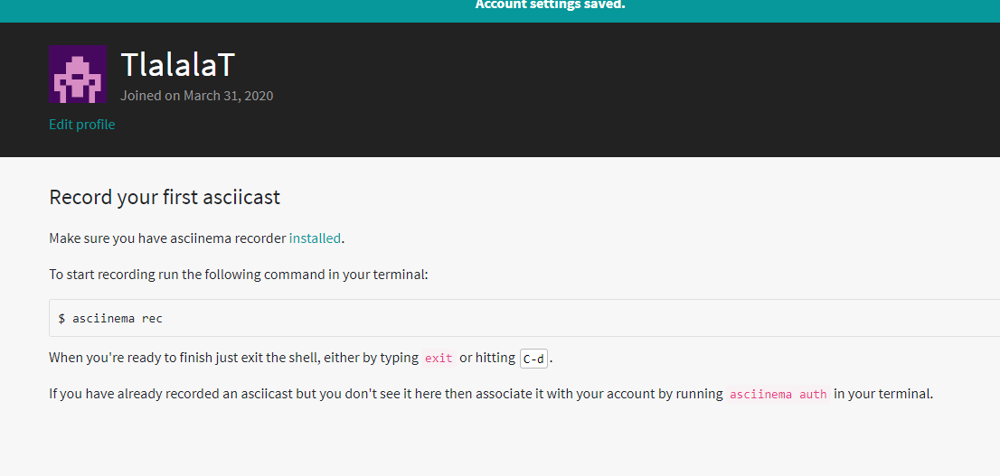
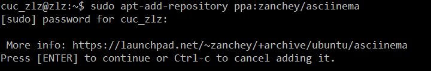
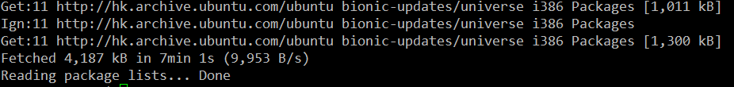
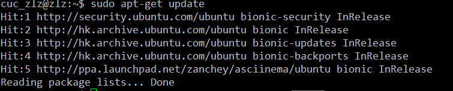
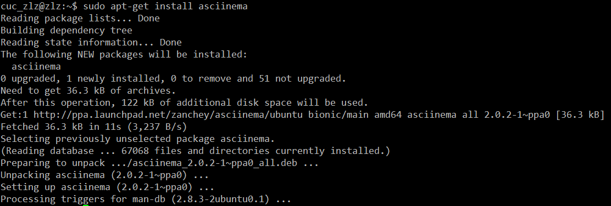
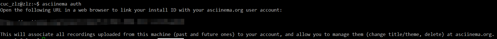
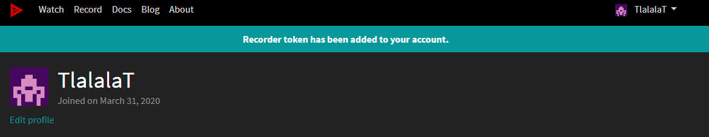
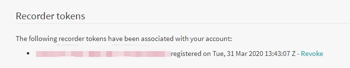

# 第二章实验

---

## 1. 注册并安装asciinema

* ### 注册asciinema

* ### 安装并配置asciinema auth
   1. #### 安装asciinema

安装仓库

更新源

安装asciinema

   2. #### 配置asciinema

配置asciinema

---

## 2. vimtutor完成后的自查

