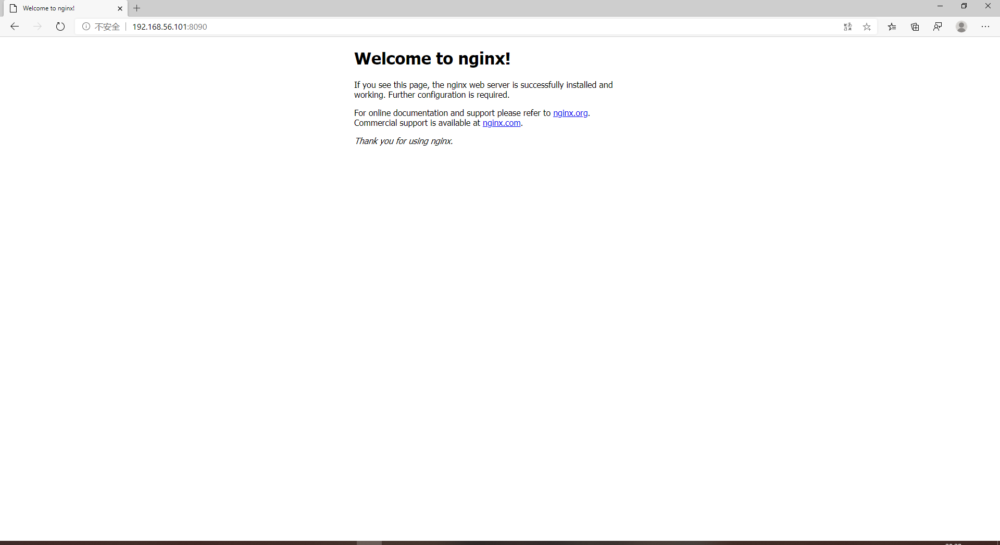

---

title: exp0x05
author: zlz

---

# 第五章实验

---

## 基本要求

参考资料：

[How To Install Linux, Nginx, MySQL, PHP (LEMP stack) on Ubuntu 18.04](https://www.digitalocean.com/community/tutorials/how-to-install-linux-nginx-mysql-php-lemp-stack-ubuntu-18-04)

[How To Install WordPress with LEMP on Ubuntu 18.04](https://www.digitalocean.com/community/tutorials/how-to-install-wordpress-with-lemp-on-ubuntu-18-04)

* 在一台主机（虚拟机）上同时配置Nginx和VeryNginx

为了便于Nginx和VeryNginx同时启动，在虚拟机上添加了第二块hostonly网卡 

同时启动成功

成功用nginx反向代理PHP-fpm

* 使用Wordpress搭建的站点对外提供访问的地址为： https://wp.sec.cuc.edu.cn

安装成功workpress

---

## 安全加固要求

---

## VeryNginx配置要求

---

## 经验总结：

* 查找资料时，一定要注意资料来源和内容的可靠性，绝不能在网上随便找到篇博客就开始参考
* 修改配置文件时一定一定要注意做好备份，出现问题可以立马还原