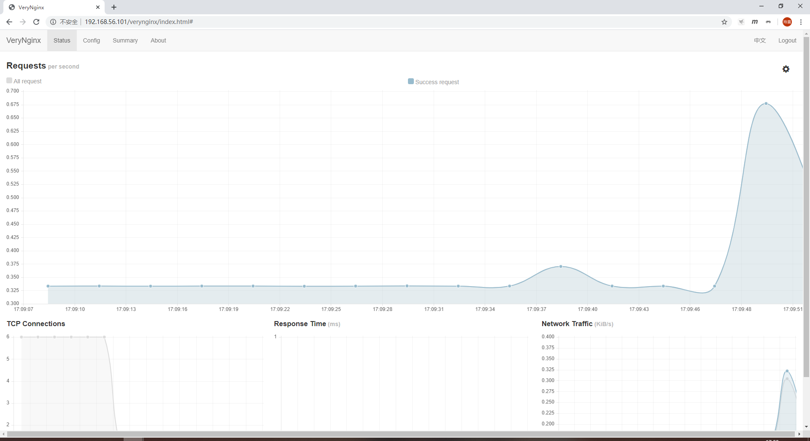
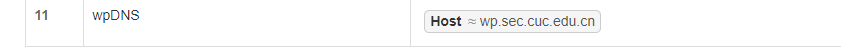
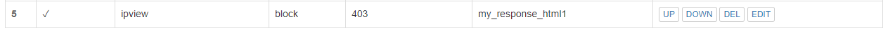
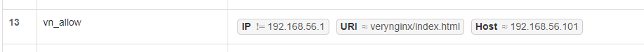
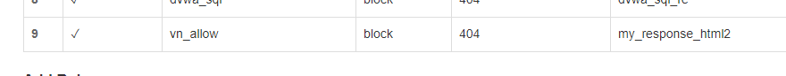

---

title: exp0x05
author: zlz

---

# 第五章实验

---

## 参考资料

* [How To Install Linux, Nginx, MySQL, PHP (LEMP stack) on Ubuntu 18.04](https://www.digitalocean.com/community/tutorials/how-to-install-linux-nginx-mysql-php-lemp-stack-ubuntu-18-04)
* [How To Install WordPress with LEMP on Ubuntu 18.04](https://www.digitalocean.com/community/tutorials/how-to-install-wordpress-with-lemp-on-ubuntu-18-04)
* [How to Install and Configure DVWA Lab on Ubuntu 18.04 server](https://kifarunix.com/how-to-setup-damn-vulnerable-web-app-lab-on-ubuntu-18-04-server/)
* [VeryNginx](https://github.com/alexazhou/VeryNginx)

## 基本要求

* ### 在一台主机（虚拟机）上同时配置Nginx和VeryNginx，Nginx监听8090端口，VeryNginx监听80端口

同时启动成功

成功用nginx反向代理PHP-fpm

* ### 使用Wordpress搭建的站点对外提供访问的地址为： http://wp.sec.cuc.edu.cn，监听8090端口

安装成功workpress

* ### 使用Damn Vulnerable Web Application (DVWA)搭建的站点对外提供访问的地址为： http://dvwa.sec.cuc.edu.cn，监听8080端口

成功安装dvwa

* ### verynginx反向代理配置

通过反向代理实现用域名访问网站

---

## 安全加固要求

* ### 使用IP地址方式均无法访问上述任意站点，并向访客展示自定义的**友好错误提示信息页面-1**

matcher设置

filter设置

实验结果

* ### Damn Vulnerable Web Application (DVWA)只允许白名单上的访客来源IP，其他来源的IP访问均向访客展示自定义的**友好错误提示信息页面-2**

matcher设置

filter设置

实验结果

宿主机成功访问

* ### 在不升级Wordpress版本的情况下，通过定制VeryNginx的访问控制策略规则，**热**修复[WordPress \< 4.7.1 - Username Enumeration](https://www.exploit-db.com/exploits/41497/)

实验漏洞页

matcher设置

filter设置

修复结果

* ### 通过配置VeryNginx的Filter规则实现对Damn Vulnerable Web Application (DVWA)的SQL注入实验在低安全等级条件下进行防护

matcher设置

filter设置

自定义提示界面

---

## VeryNginx配置要求

* ### VeryNginx的Web管理页面仅允许白名单上的访客来源IP，其他来源的IP访问均向访客展示自定义的**友好错误提示信息页面-3**

matcher设置

filter设置

* ### 通过定制VeryNginx的访问控制策略规则实现：
    * 限制DVWA站点的单IP访问速率为每秒请求数 < 50
    * 限制Wordpress站点的单IP访问速率为每秒请求数 < 20
    * 超过访问频率限制的请求直接返回自定义**错误提示信息页面-4**
    * 禁止curl访问

#### 限制DVWA站点的单IP访问速率为每秒请求数 < 50，限制Wordpress站点的单IP访问速率为每秒请求数 < 20，超过访问频率限制的请求直接返回自定义**错误提示信息页面-4**

具体配置

#### 禁止curl访问

matcher设置

filter设置

实验结果

---

## 经验总结：

* 查找资料时，一定要注意资料来源和内容的可靠性，绝不能在网上随便找到篇博客就开始参考
* 修改配置文件时一定一定要注意做好备份，出现问题可以立马还原
* 学会分层查找确认问题