---

title: 第五章实验
author: zlz

---

# 第五章实验

---

* ### 本实验配置了两台虚拟机，一台作为服务器端，主机名为zlz，一台作为客户端，主机名为cilent，系统版本均为Ubuntu18.04，服务器端的host-only网卡IP地址为192.168.56.101，客户端host-only网卡IP地址为192.168.56.104
* ### 在实验前先配置从服务器端通过ssh免密登录到客户端

生成并传输密钥

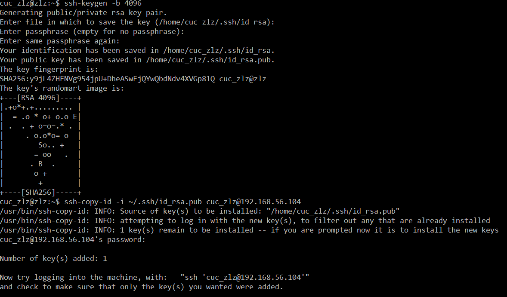

免密登录成功

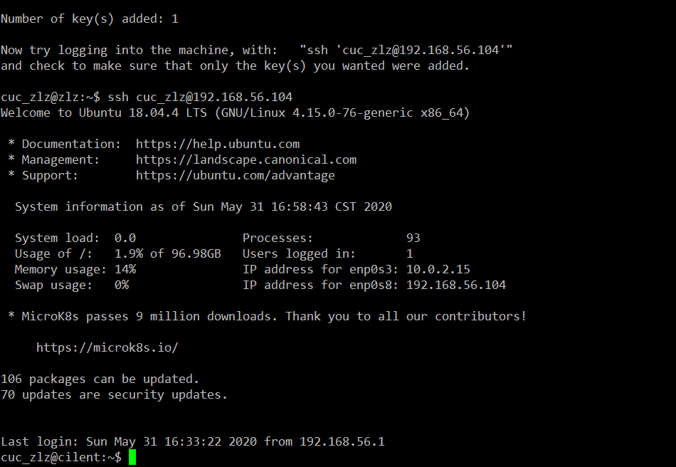

---

## FTP服务器配置任务

软件环境：proftpd

* [X] 配置一个提供匿名访问的FTP服务器，匿名访问者可以访问1个目录且仅拥有该目录及其所有子目录的只读访问权限；
* [X] 配置一个支持用户名和密码方式访问的账号，该账号继承匿名访问者所有权限，且拥有对另1个独立目录及其子目录完整读写（包括创建目录、修改文件、删除文件等）权限；
    * 该账号仅可用于FTP服务访问，不能用于系统shell登录；
* [X] FTP用户不能越权访问指定目录之外的任意其他目录和文件；
* [X] 匿名访问权限仅限白名单IP来源用户访问，禁止白名单IP以外的访问；

### 1. 在服务器端安装proftpd

```
sudo apt update
sudo apt install proftpd
```

### 2. 配置一个提供匿名访问的FTP服务器，匿名访问者可以访问1个目录且仅拥有该目录及其所有子目录的只读访问权限

修改配置文件proftpd.conf

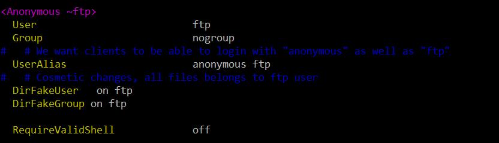


### 3. 配置一个支持用户名和密码方式访问的账号，该账号继承匿名访问者所有权限，且拥有对另1个独立目录及其子目录完整读写（包括创建目录、修改文件、删除文件等）权限，该账号仅可用于FTP服务访问，不能用于系统shell登录

修改配置文件proftpd.conf

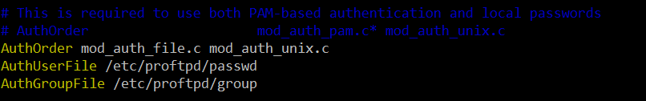

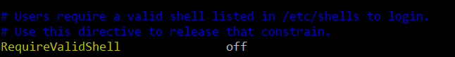

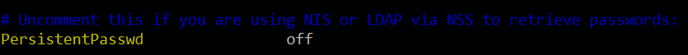

```
#创建虚拟用户的本地ftp文件夹
sudo mkdir /home/virtual
#创建用户
sudo ftpasswd --passwd --file=/etc/proftpd/passwd --name=virtual_ftp --uid=1025 --home=/home/virtual --shell=/bin/false
#创建用户组
sudo ftpasswd --file=/etc/proftpd/group --group --name=virtual_ftp_users --gid=1024
#将用户加入用户组
sudo ftpasswd --group --name=virtual_ftp_users --gid=1024 --member=virtual_ftp --file=/etc/proftpd/group
#修改文件夹权限
sudo chown -R 1024:1024 /home/virtual
sudo chmod -R 700 /home/virtual
```

### 4. FTP用户不能越权访问指定目录之外的任意其他目录和文件

修改配置文件proftpd.conf

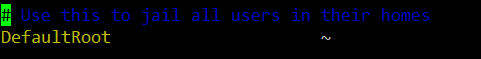

### 5. 匿名访问权限仅限白名单IP来源用户访问，禁止白名单IP以外的访问

修改配置文件proftpd.conf


### 6. 配置结果展示

匿名访问ftp服务器测试

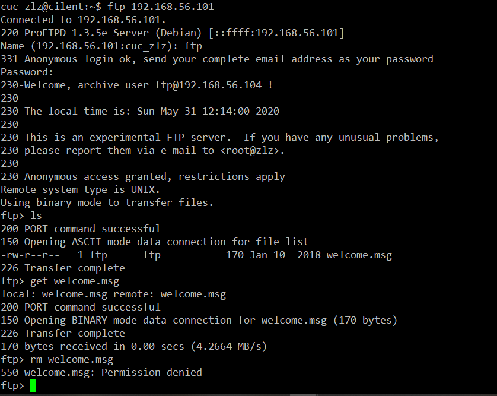

白名单屏蔽结果


---

## NFS服务器配置任务

* [X] 在1台Linux上配置NFS服务，另1台电脑上配置NFS客户端挂载2个权限不同的共享目录，分别对应只读访问和读写访问权限；
* [X] 实验报告中请记录你在NFS客户端上看到的：
    * 共享目录中文件、子目录的属主、权限信息
    * 你通过NFS客户端在NFS共享目录中新建的目录、创建的文件的属主、权限信息
    * 上述共享目录中文件、子目录的属主、权限信息和在NFS服务器端上查看到的信息一样吗？无论是否一致，请给出你查到的资料是如何讲解NFS目录中的属主和属主组信息应该如何正确解读

### 1. 在1台Linux上配置NFS服务，另1台电脑上配置NFS客户端挂载2个权限不同的共享目录，分别对应只读访问和读写访问权限

安装NFS服务

```
sudo apt update
sudo apt install nfs-kernel-server 
```

安装NFS客户端

```
sudo apt update
sudo apt install nfs-common
```

在服务器端创建共享目录

```
sudo mkdir /var/nfs/general -p
sudo chown nobody:nogroup /var/nfs/general
```

配置服务器端NFS配置文件，/home为只读访问，/var/nfs.general为读写访问

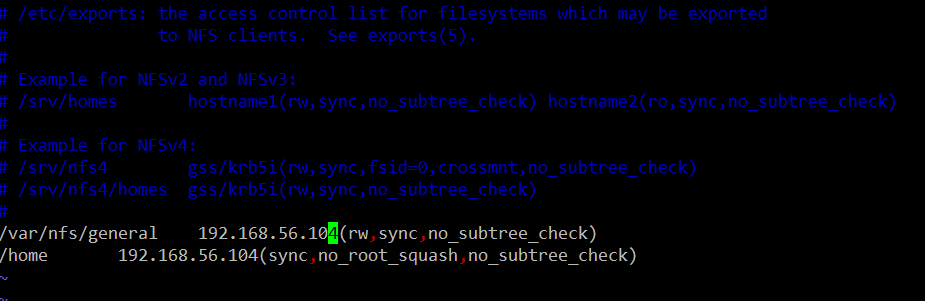

在客户端上创建挂载点和挂载目录

```
sudo mkdir -p /nfs/general
sudo mkdir -p /nfs/home
sudo mount 192.168.56.101:/var/nfs/general /nfs/
sudo mount 192.168.56.101:/home /nfs/home
```

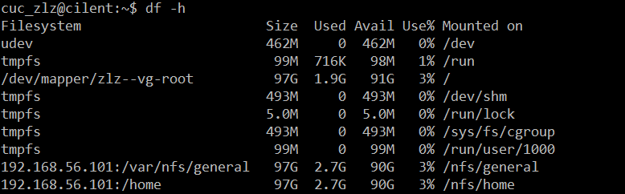

### 2. 记录在NFS客户端上看到的

共享目录中文件、子目录的属主、权限信息

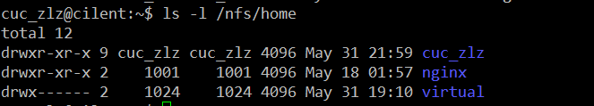

通过NFS客户端在NFS共享目录中新建的目录、创建的文件的属主、权限信息

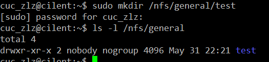

服务器端信息

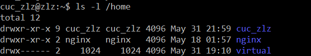

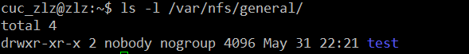

参考链接中对于此的说明：

Because we mounted this volume without changing NFS’s default behavior and created the file as the client machine’s root user via the sudo command, ownership of the file defaults to nobody:nogroup. Client superusers won’t be able to perform typical administrative actions, like changing the owner of a file or creating a new directory for a group of users, on this NFS-mounted share.

而如果添加了 no_root_squash参数，可以使用root 用户

We created home.test as root via the sudo command, exactly the same way we created the general.test file. However, in this case it is owned by root because we overrode the default behavior when we specified the no_root_squash option on this mount. This allows our root users on the client machine to act as root and makes the administration of user accounts much more convenient. At the same time, it means we don’t have to give these users root access on the host.

---

## DHCP服务器配置任务
    
* [X] 2台虚拟机使用Internal网络模式连接，其中一台虚拟机上配置DHCP服务，另一台服务器作为DHCP客户端，从该DHCP服务器获取网络地址配置


---

## Samba服务器配置和客户端配置连接测试

* [X] Linux访问Windows的匿名共享目录
* [X] Linux访问Windows的用户名密码方式共享目录
* [X] [下载整个目录](https://indradjy.wordpress.com/2010/04/14/getting-whole-folder-using-smbclient/)

---

## DNS

* [X] 基于上述Internal网络模式连接的虚拟机实验环境，在DHCP服务器上配置DNS服务，使得另一台作为DNS客户端的主机可以通过该DNS服务器进行DNS查询
    * 在DNS服务器上添加 `zone "cuc.edu.cn"` 的以下解析记录

```
ns.cuc.edu.cn NS
ns A <自行填写DNS服务器的IP地址>
wp.sec.cuc.edu.cn A <自行填写第5章实验中配置的WEB服务器的IP地址>
dvwa.sec.cuc.edu.cn CNAME wp.sec.cuc.edu.cn
```

---

ps：config文件夹中保存着实验用到的所有配置文件，shell文件夹中保存着本次实验所编写的shell脚本，shell文件夹中的vars.sh定义许多变量，是配置文件，main.sh是一键部署的入口脚本，调用 ssh-root.sh 配置目标机的root用户免密ssh登录，调用 apt-install.sh 在目标机上安装必要的程序，并对配置文件进行备份，调用 action.sh 在目标机上进行创建用户、创建目录、修改权限、重启服务等必要的操作


参考资料：

[linux/2017-1/snRNA/ex6/](https://github.com/CUCCS/linux/tree/master/2017-1/snRNA/ex6)

[How To Set Up an NFS Mount on Ubuntu 18.04](https://www.digitalocean.com/community/tutorials/how-to-set-up-an-nfs-mount-on-ubuntu-18-04)

[Setting up Samba as a Standalone Server](https://wiki.samba.org/index.php/Setting_up_Samba_as_a_Standalone_Server)
